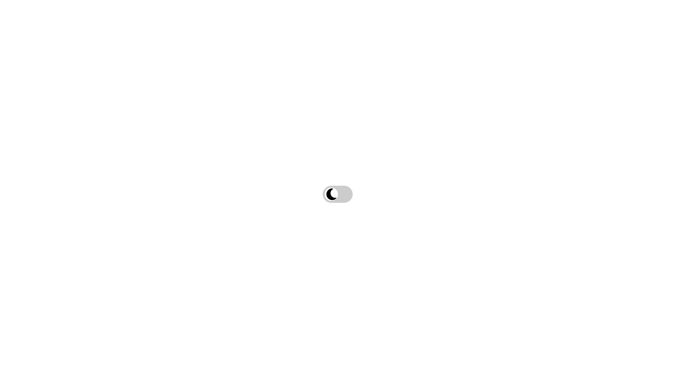

# Day/Night Mode Toggle. [live link](https://sathya-daynightmode.netlify.app/)

This project features a Day/Night Mode toggle switch that allows users to switch between a light mode (Day) and a dark mode (Night) by toggling a switch. The background color of the page and the image on the toggle switch change based on the selected mode.

## Features

- **Day/Night Toggle Switch**: A user-friendly switch to toggle between Day and Night modes.
- **Background Color Change**: The background color of the page changes based on the selected mode.
- **Image Change**: The image on the toggle switch changes to represent the current mode (e.g., moon for Night mode and sun for Day mode).

### Day Mode

### Night Mode

